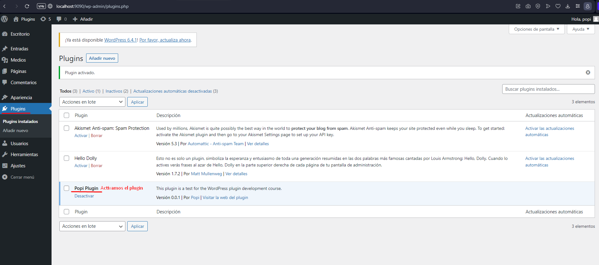
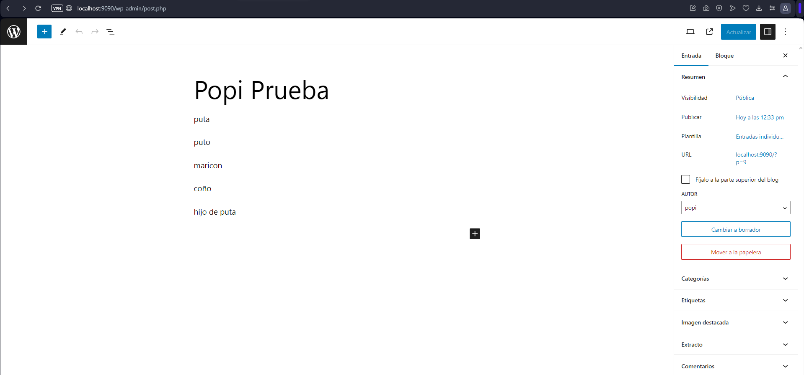
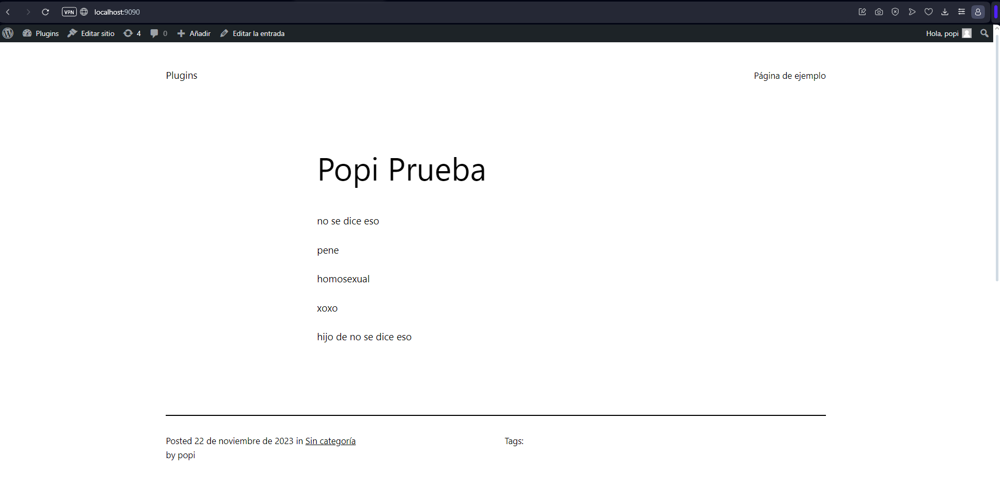

# Tarea de Plugin

## Enunciado:

Realiza un plugin en WP que utilice el hook 'the_content' (fijaros en los comentarios, 
hay mucha información muy interesante):

El plugin tiene que recorrer el contenido del post (esto ya lo hace el hook) y sustituir 
cinco palabras (pueden ser, por ejemplo, malsonantes) por otras. Utiliza array o 
algín tipo de dato parecido en PHP.

Ten en cuenta que este plugin vamos a seguir trabajando en él para que utilice la base de 
datos de WP y también que se pueda configurar desde el backend. Por lo tanto, estructura 
bien el código, separa los datos de la parte lógica, realiza funciones sencillas que 
realizen una sola cosa. De esta manera podremos ir evolucinando el código.

Adjunta el repositorio con únicamente el directorio del plugin, con un Readme explicatorio.

Se tiene que poder clonar el repositorio directamente en la carpeta plugin y activarlo desde 
cualquier instalación de WP. 

## Explicación:

1. Primero activamos el plugin:

2. Una vez activado el plugin, debemos crear una nueva entrada

3. Una vez creada la entrada, le damos a ver la entrada y veremos como nuestro texto cambia

        Como curiosidad podemos ver que al tener cambiada la palabra 'puta' por la palabra 'no se dice eso', cuando abajo de todo ponemos 
        'hijo de puta'  nos cambiará la palabra 'puta' por 'no se dice eso' y quedaría 'hijo de no se dice eso'.

## Pensaba que ya se había acabado, pero no, hay más:

    Por lo que se ve el profe quiere seguir trabajando en este proyecto así que a seguir. 

